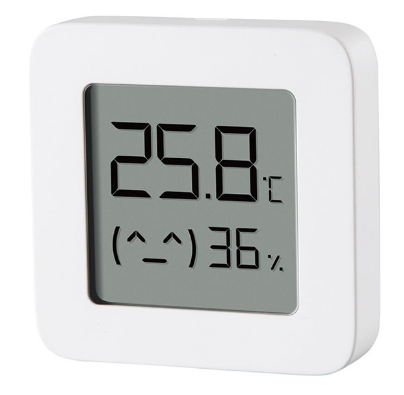
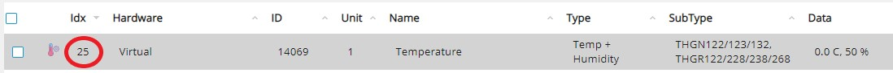

# Xiaomi Mi Temperature and Humidity Monitor 2 - Domoticz

  

The Xiaomi Mi sensor provides temperature and humidity over BLE.



## How it works

1. ##### Preparing Domoticz

   Create a virtual sensor (Temperature & Humidity) in Domoticz (as much as you need).

   

   Note the IDX value of virtual sensor (Setup/Devices)!

   

   If you want to get the raw voltage of battery, you also need to create the Voltage sensors too. The IDX value of the sensor is also required!

2. ##### Finding the Bluetooth MAC Address of the sensor

   Turn on the Xiaomi Mi sensor (Insert the battery).

   Run the following command to find the MAC address:

   ```shell
   sudo hcitool lescan
   ```

   Example result:

   ```shell
   LE Scan ...
   46:4D:55:28:41:CA (unknown)
   A4:C1:38:DC:8F:2E LYWSD03MMC
   ```

   The name is always LYWSD03MMC.

   Note down the MAC address!

3. ##### Prepare the required modules

   Install modules:

   ```shell
   sudo apt update
   sudo apt install -y python3 pip3 git
   sudo pip3 install pycopy-binascii requests logging bluepy
   ```

4. ##### Edit the *xiaomiBleLywsd03mmc.py* script

   Clone repository:

   ```shell
   git clone https://github.com/erdose/xiaomi-mi-lywsd03mmc.git
   ```

   Open the ***xiaomiBleLywsd03mmc.py*** and edit the parameters at the top of the script!

   ```shell
   cd xiaomi-mi-lywsd03mmc
   sudo nano xiaomiBleLywsd03mmc.py
   ```

   ```python
   # domoticz configuration
   DOMOTICZ_SERVER_IP = "xxx.xxx.x.xxx"
   DOMOTICZ_SERVER_PORT = "xxxx"
   DOMOTICZ_USERNAME = ""
   DOMOTICZ_PASSWORD = ""
   ```

   ***MAC*** : MAC address of the Xiaomi Mi sensor.

   ***TH_IDX*** : IDX value of the Temperature & Humidity sensor(s) in Domoticz.

   ***VOLTAGE_IDX*** : IDX value of the Voltage sensor(s) in Domoticz.

   ```python
   # sensor dictionary to add own sensors
   # if you don't want to use the raw voltage option, just write -1 in the VOLTAGE_IDX value field
   sensors = {     1: {"MAC": "xx:xx:xx:xx:xx:xx", "TH_IDX": 1, "VOLTAGE_IDX": -1},
   		2: {"MAC": "xx:xx:xx:xx:xx:xx", "TH_IDX": 2, "VOLTAGE_IDX": -1},
   		3: {"MAC": "xx:xx:xx:xx:xx:xx", "TH_IDX": 3, "VOLTAGE_IDX": -1}}
   ```

   ***TEMPERATURE_PREC***: Accuracy of the temperature value.

   ```python
   # other configuration
   TEMPERATURE_PREC = 2
   ```

5. ##### Schedule the update interval

   Enable the script to run at a regular interval (5 mins):

   ```shell
   sudo crontab -e
   ```

   Add this line:

   ```shell
   */5 * * * * python3 /home/pi/xiaomi-mi-lywsd03mmc/xiaomiBleLywsd03mmc.py
   ```

   Done!
------
<a href="https://www.paypal.com/donate?hosted_button_id=6G4MHNDWJYKEY">
  
</a>
